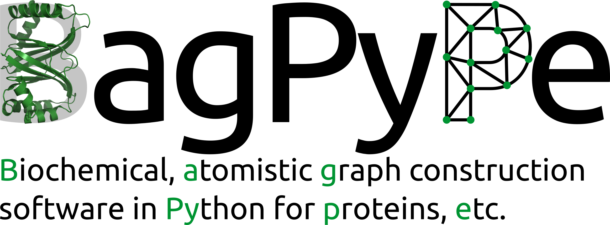

A typical bagpype run looks like this: 

```python 
import bagpype

myprot = bagpype.molecules.Protein()

parser = bagpype.parsing.PDBParser('.pdb')
parser.parse(myprot, strip = {'res_name': ['HOH']})

ggenerator = bagpype.construction.Graph_constructor()
ggenerator.construct_graph(myprot)
```
