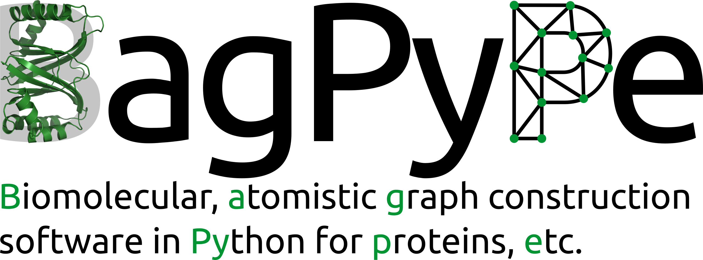

Summary
----------
BagPype is a Python package for the construction of atomistic, energy-weighted graphs from biomolecular structures, which allow for versatile and efficient modelling of their properties whilst keeping physico-chemical detail.


Method overview
--------


Starting only with *a priori* knowledge of the spatial arrangement of individual atoms obtained from structural files available at the Protein Data Bank (PDB), bagpype implements a multi-step pipeline leading to an atomistic energy-weighted graph with individual atoms as nodes and chemical interactions as edges. Whilst most graph approaches only consider strong interactions and typically only at the residue level, an advantage of our methodology lies in the inclusion of weaker interactions, such as hydrogen bonds, electrostatics, hydrophobic interactions and π-π stacking interactions in DNA. The latter enable the study of nucleic acids and their complexes with proteins. The graphs obtained by the approach presented here can be combined with any method that uses graph theoretic or network scientific information. 

Installation
--------
To install the official Python Package Index version of bagpype:
```
pip install bagpype
```
To install the latest version, directly from this GitHub repository:
```
pip install git+https://github.com/FlorianSong/BagPype
```


Usage
-------
A typical bagpype run looks like this: 

```python 
import bagpype

myprot = bagpype.molecules.Protein()

parser = bagpype.parsing.PDBParser('.pdb')
parser.parse(myprot, strip = {'res_name': ['HOH']})

ggenerator = bagpype.construction.Graph_constructor()
ggenerator.construct_graph(myprot)
```

Bugs
--------
Please report any bugs that you find [here](<https://github.com/FlorianSong/BagPype/issues>). Or better yet, please feel free to fork the repository and submit a pull request.

